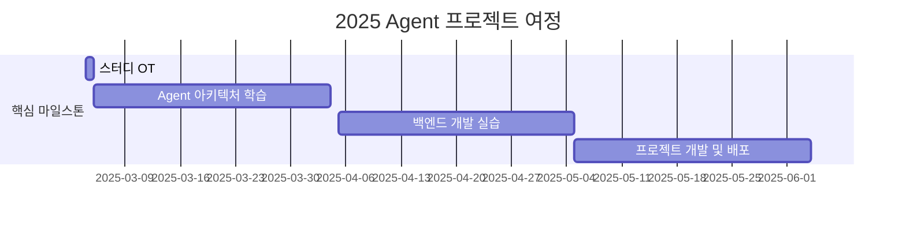

<h1 align="center">Agent is All You Need!</h1>

<div align="center">
<a href="https://pseudo-lab.com"></a>
<a href="https://discord.gg/EPurkHVtp2"></a>
<a href="https://github.com/Pseudo-Lab/10th-template/stargazers"></a>
<a href="https://github.com/Pseudo-Lab/10th-template/network/members"></a>
<a href="https://github.com/Pseudo-Lab/10th-template/pulls"></a>
<a href="https://github.com/Pseudo-Lab/10th-template/issues"></a>
<a href="https://github.com/Pseudo-Lab/10th-template/graphs/contributors"></a>
<a href="https://hits.seeyoufarm.com"></a>
</div>
<br>
<p align="center">
  
</p>

> Agent 시대의 도전! 이론에서 프로덕션까지, 실전 Agent 개발 스터디에 오신 것을 환영합니다. 우리는 최신 Agent 기술을 탐구하고 실제 서비스를 구현하는 여정을 함께합니다.


## 🌟 Why This Study?
<p align="center">

</p>
2025년은 'AI 에이전트'의 해로 주목받고 있습니다. 가트너의 예측에 따르면 2028년까지 일상 업무의 15%를 AI 에이전트가 독자적으로 결정할 것으로 전망되며, 이미 주요 기업들의 치열한 개발 경쟁이 시작되었습니다.  
<br>  


### 📈 Market Insight
- **투자 규모** `82억 달러` (2024년 기준, 전년 대비 80% 증가)
- **스타트업 투자** `156건` (12개월 기준)
- **주요 플랫폼**
  - 구글 `제미나이 2.0`
  - 아마존 `아마존Q`
  - 마이크로소프트 `코파일럿 스튜디오`

### 🔑 AI Agent의 핵심 가치
```
🧠 독자적 의사결정    🕒 24/7 풀타임 운영
🎯 도메인 전문성      🚀 인간 능력 확장
```

## 📚 커리큘럼

### 이론 학습
- 🛠️ **최신 프레임워크 마스터링**
  - LangChain, LangGraph
  - LlamaIndex
  - AutoGen
  - Crew AI
  - hard coding 
- 🎯 **핵심 기술 역량**
  - Prompt Engineering
  - Agent 설계 패턴
  - 윤리적 고려사항
  - Multi-Agent 시스템

### 💻 실전 개발
- 🌐 **백엔드 아키텍처**
  ```
  FastAPI | Flask | Spring
  ```
- 🚀 **인프라 구축**
  ```
  Docker | Kubernetes | CI/CD
  ```
- 📊 **모니터링 시스템**
  ```
  로깅 | 메트릭스 | 알림
  ```

> **평소에 구현해보고 싶은게 없으셨나요? 같이 만들면서 성장해요 🌱**

🔗 [MultiAgent Backend Repository](https://github.com/jh941213/multiagent_backend)


## 🧑 역동적인 팀 소개 (Dynamic Team)

| 역할 | 이름 | 기술 스택 | 주요 관심 분야 |
|------|------|------------|----------------|
| **Project Manager** | JaeHyun KIM|   | Agent 아키텍처, 백엔드 개발 |

## 🚀 프로젝트 로드맵 (Project Roadmap)


## 📅 주차별 활동 (Activity History)

## 일정 개요
| 주차   | 날짜         | 내용                                         | 발표자 |
|--------|------------|--------------------------------------------|--------|
| 1주차  | 2025/03/09 | OT & 아이스브레이킹                        | -      |
| 2주차  | 2025/03/16 | 팀 개편 및 주제 선정                        | 미정   |
| 3주차  | 2025/03/23 | Agent 관련 논문 발표 및 프로젝트 상황 공유  | 미정   |
| 4주차  | 2025/03/30 | Agent 관련 논문 발표 및 프로젝트 상황 공유  | 미정   |
| 5주차  | 2025/04/06 | Agent 관련 논문 발표 및 프로젝트 상황 공유  | 미정   |
| 6주차  | 2025/04/13 | Agent 관련 논문 발표 및 프로젝트 상황 공유  | 미정   |
| 7주차  | 2025/04/20 | Agent 관련 논문 발표 및 프로젝트 상황 공유  | 미정   |
| 8주차  | 2025/04/27 | Agent 관련 논문 발표 및 프로젝트 상황 공유  | 미정   |
| 9주차  | 2025/05/04 | Agent 관련 논문 발표 및 프로젝트 상황 공유  | 미정   |
| 10주차 | 2025/05/11 | Agent 관련 논문 발표 및 프로젝트 상황 공유  | 미정   |
| 11주차 | 2025/05/18 | 프로젝트 최종 점검                          | 미정   |
| 12주차 | 2025/05/25 | 최종 프로젝트 발표                          | 전원   |

## 🛠️ 우리의 스터디 문화 (Our Study Culture)
- Communication: Discord
- Version Control: GitHub
- Documentation: GitHub Wiki
- 주말 "모각코" 진행 (선택) 
- 매주 기술 블로그 1주일 1회 업로드 '필수'  
- Creative Spark⚡️ 모두에게 창의력을 !

## 📈 성과 지표 (Achievement Metrics)
**2025 주요 KPI**
| 지표 | 목표치 | 현재 달성률 |
|------|---------|-------------|
| Agent 구현 프로젝트 | n 개 | 0% |
| 기술 블로그 포스팅 | 160개 | 0% |

## 🌱 참여 안내 (How to Engage)
- 모집 기간: 2025.02.15 - 02.22
- 스터디 기간: 12주
- 주 1회 정기 모임 + 주말 모각코
- 모집 인원: 최대 16명 (팀을 나눠서 진행합니다)

## Acknowledgement 🙏

OOO is developed as part of Pseudo-Lab's Open Research Initiative. Special thanks to our contributors and the open source community for their valuable insights and contributions.

## About Pseudo Lab 👋🏼</h2>

[Pseudo-Lab](https://pseudo-lab.com/) is a non-profit organization focused on advancing machine learning and AI technologies. Our core values of Sharing, Motivation, and Collaborative Joy drive us to create impactful open-source projects. With over 5k+ researchers, we are committed to advancing machine learning and AI technologies.

<h2>Contributors 😃</h2>
<a href="https://github.com/Pseudo-Lab/Agent_is_all_you_need/contributors">
  
</a>
<br><br>


## License 🗞
This project is licensed under the [MIT License](https://opensource.org/licenses/MIT).
