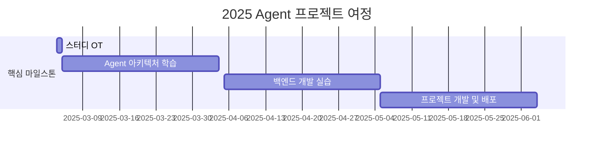

# Agent is All You Need!

<h1 align="center">Agent is All You Need!</h1>

 

> Agent 시대의 도전! 이론에서 프로덕션까지, 실전 Agent 개발 스터디에 오신 것을 환영합니다. 우리는 최신 Agent 기술을 탐구하고 실제 서비스를 구현하는 여정을 함께합니다.

## 🌟 Why This Study?
AI 기술이 급속도로 발전하면서, 단순히 AI를 사용하는 것을 넘어 Agent를 활용한 새로운 가치 창출이 중요해지고 있습니다. 특히 2025년에는 AI Agent가 다양한 산업 분야에서 핵심 역할을 할 것으로 예상됩니다.

우리 스터디는 최신 Agent 아키텍처를 깊이 있게 이해하고, 이를 실제 서비스로 구현하는 것을 목표로 합니다. 단순한 이론 학습을 넘어, 실제 프로덕션 환경에서 작동하는 Agent를 개발하고 운영하는 경험을 쌓을 수 있습니다.

## 🌟 우리는 이런 것을 함께 공부합니다
_"이론에서 프로덕션까지"_
- 최신 Agent 아키텍처 심층 분석
- 백엔드 개발 실전 (FastAPI/Flask/Spring)
- 실제 서비스 배포 및 운영
- CS 지식 및 백엔드 역량 강화

## 🧑 역동적인 팀 소개 (Dynamic Team)

| 역할 | 이름 | 기술 스택 | 주요 관심 분야 |
|------|------|------------|----------------|
| **Project Manager** | JaeHyun KIM|   | Agent 아키텍처, 백엔드 개발 |

## 🚀 프로젝트 로드맵 (Project Roadmap)

## 📅 주차별 활동 (Activity History)

## 일정 개요
| 주차   | 날짜         | 내용                                         | 발표자 |
|--------|------------|--------------------------------------------|--------|
| 1주차  | 2025/03/09 | OT & 아이스브레이킹                        | -      |
| 2주차  | 2025/03/16 | 팀 개편 및 주제 선정                        | 미정   |
| 3주차  | 2025/03/23 | Agent 관련 논문 발표 및 프로젝트 상황 공유  | 미정   |
| 4주차  | 2025/03/30 | Agent 관련 논문 발표 및 프로젝트 상황 공유  | 미정   |
| 5주차  | 2025/04/06 | Agent 관련 논문 발표 및 프로젝트 상황 공유  | 미정   |
| 6주차  | 2025/04/13 | Agent 관련 논문 발표 및 프로젝트 상황 공유  | 미정   |
| 7주차  | 2025/04/20 | Agent 관련 논문 발표 및 프로젝트 상황 공유  | 미정   |
| 8주차  | 2025/04/27 | Agent 관련 논문 발표 및 프로젝트 상황 공유  | 미정   |
| 9주차  | 2025/05/04 | Agent 관련 논문 발표 및 프로젝트 상황 공유  | 미정   |
| 10주차 | 2025/05/11 | Agent 관련 논문 발표 및 프로젝트 상황 공유  | 미정   |
| 11주차 | 2025/05/18 | 프로젝트 최종 점검                          | 미정   |
| 12주차 | 2025/05/25 | 최종 프로젝트 발표                          | 전원   |

## 🛠️ 우리의 스터디 문화 (Our Study Culture)
- Communication: Discord
- Version Control: GitHub
- Documentation: GitHub Wiki
- 주말 "모각코" 진행
- 동료 피드백 문화

## 📈 성과 지표 (Achievement Metrics)
**2025 주요 KPI**
| 지표 | 목표치 | 현재 달성률 |
|------|---------|-------------|
| Agent 구현 프로젝트 | 3개 | 0% |
| 기술 블로그 포스팅 | 12개 | 0% |

## 🌱 참여 안내 (How to Engage)
- 모집 기간: 2025.02.15 - 02.22
- 스터디 기간: 12주
- 주 1회 정기 모임 + 주말 모각코
- 모집 인원: 최대 16명

## Acknowledgement 🙏

OOO is developed as part of Pseudo-Lab's Open Research Initiative. Special thanks to our contributors and the open source community for their valuable insights and contributions.

## About Pseudo Lab 👋🏼</h2>

[Pseudo-Lab](https://pseudo-lab.com/) is a non-profit organization focused on advancing machine learning and AI technologies. Our core values of Sharing, Motivation, and Collaborative Joy drive us to create impactful open-source projects. With over 5k+ researchers, we are committed to advancing machine learning and AI technologies.

<h2>Contributors 😃</h2>

  

## License 🗞
This project is licensed under the [MIT License](https://opensource.org/licenses/MIT).
