# Agent is All You Need!

<h1 align="center">Agent is All You Need!</h1>

 

  

> Agent 시대의 도전! 이론에서 프로덕션까지, 실전 Agent 개발 스터디에 오신 것을 환영합니다. 우리는 최신 Agent 기술을 탐구하고 실제 서비스를 구현하는 여정을 함께합니다.

## 🌟 Why This Study?

2025년은 'AI 에이전트'의 해로 주목받고 있습니다. 가트너의 예측에 따르면 2028년까지 일상 업무의 15%를 AI 에이전트가 독자적으로 결정할 것으로 전망되며, 이미 주요 기업들의 치열한 개발 경쟁이 시작되었습니다.  
   

**🚀 급성장하는 AI 에이전트 시장**  

- 투자 규모: 2024년 기준 82억 달러 (전년 대비 80% 증가)  
- 156건의 스타트업 투자 유치 (12개월 기준)  
- 구글의 '제미나이 2.0', 아마존의 '아마존Q', 마이크로소프트의 '코파일럿 스튜디오' 등 대규모 플랫폼 출시  

**💡 AI 에이전트의 핵심 특징**  

- 독자적인 환경 인식과 의사결정 능력  
- 24/7 풀타임 작업 수행  
- 도메인 특화된 전문성  
- 인간의 물리적 한계 보완  

**🎯 스터디를 통한 성장**  
우리 스터디는 이러한 시장의 급격한 변화 속에서, AI 에이전트 개발의 최전선에 설 수 있는 실전 역량을 기르는 것을 목표로 합니다. 단순한 이론 학습을 넘어, 실제 프로덕션 레벨의 에이전트를 설계하고 구현하는 전문가로 성장할 수 있습니다.

## 🌟 우리는 이런 것을 함께 공부합니다
🌟 우리는 이런 것을 함께 공부합니다

**"이론에서 프로덕션까지"**
📚 이론 학습

- LangChain, LlamIndex, AutoGen, Crew AI  등 최신 Agent 프레임워크 심층 분석
- Prompt Engineering과 Agent 설계 패턴
- Agent의 윤리적 고려사항과 안전성 확보 방안
- Multi-Agent 시스템 설계와 구현

💻 실전 개발

- FastAPI/Flask/Spring 기반 백엔드 아키텍처 설계
- Docker, Kubernetes를 활용한 확장 가능한 인프라 구축
- 실시간 모니터링과 로깅 시스템 구현
- Git Action CI/CD 파이프라인 구축

🔍 프로젝트 실습

- 산업별 특화 Agent 개발 (금융, 의료, 교육 등)

> **평소에 구현해보고 싶은게 없으셨나요? 같이 만들면서 성장해요 🌱**

🔗 [MultiAgent Backend Repository](https://github.com/jh941213/multiagent_backend)

## 🧑 역동적인 팀 소개 (Dynamic Team)

| 역할 | 이름 | 기술 스택 | 주요 관심 분야 |
|------|------|------------|----------------|
| **Project Manager** | JaeHyun KIM|   | Agent 아키텍처, 백엔드 개발 |

## 🚀 프로젝트 로드맵 (Project Roadmap)

```mermaid
gantt
    title 2025 Agent 프로젝트 여정
    section 핵심 마일스톤
    스터디 OT       :2025-03-04, 1d
    Agent 아키텍처 학습       :2025-03-05, 30d
    백엔드 개발 실습        :2025-04-05, 30d
    프로젝트 개발 및 배포   :2025-05-05, 30d
```

## 📅 주차별 활동 (Activity History)

## 일정 개요
| 주차   | 날짜         | 내용                                         | 발표자 |
|--------|------------|--------------------------------------------|--------|
| 1주차  | 2025/03/09 | OT & 아이스브레이킹                        | -      |
| 2주차  | 2025/03/16 | 팀 개편 및 주제 선정                        | 미정   |
| 3주차  | 2025/03/23 | Agent 관련 논문 발표 및 프로젝트 상황 공유  | 미정   |
| 4주차  | 2025/03/30 | Agent 관련 논문 발표 및 프로젝트 상황 공유  | 미정   |
| 5주차  | 2025/04/06 | Agent 관련 논문 발표 및 프로젝트 상황 공유  | 미정   |
| 6주차  | 2025/04/13 | Agent 관련 논문 발표 및 프로젝트 상황 공유  | 미정   |
| 7주차  | 2025/04/20 | Agent 관련 논문 발표 및 프로젝트 상황 공유  | 미정   |
| 8주차  | 2025/04/27 | Agent 관련 논문 발표 및 프로젝트 상황 공유  | 미정   |
| 9주차  | 2025/05/04 | Agent 관련 논문 발표 및 프로젝트 상황 공유  | 미정   |
| 10주차 | 2025/05/11 | Agent 관련 논문 발표 및 프로젝트 상황 공유  | 미정   |
| 11주차 | 2025/05/18 | 프로젝트 최종 점검                          | 미정   |
| 12주차 | 2025/05/25 | 최종 프로젝트 발표                          | 전원   |

## 🛠️ 우리의 스터디 문화 (Our Study Culture)
- Communication: Discord
- Version Control: GitHub
- Documentation: GitHub Wiki
- 주말 "모각코" 진행 (선택) 
- 매주 기술 블로그 1주일 1회 업로드 '필수'  
- Creative Spark⚡️ 모두에게 창의력을 !

## 📈 성과 지표 (Achievement Metrics)
**2025 주요 KPI**
| 지표 | 목표치 | 현재 달성률 |
|------|---------|-------------|
| Agent 구현 프로젝트 | n 개 | 0% |
| 기술 블로그 포스팅 | 160개 | 0% |

## 🌱 참여 안내 (How to Engage)
- 모집 기간: 2025.02.15 - 02.22
- 스터디 기간: 12주
- 주 1회 정기 모임 + 주말 모각코
- 모집 인원: 최대 16명

## Acknowledgement 🙏

OOO is developed as part of Pseudo-Lab's Open Research Initiative. Special thanks to our contributors and the open source community for their valuable insights and contributions.

## About Pseudo Lab 👋🏼</h2>

[Pseudo-Lab](https://pseudo-lab.com/) is a non-profit organization focused on advancing machine learning and AI technologies. Our core values of Sharing, Motivation, and Collaborative Joy drive us to create impactful open-source projects. With over 5k+ researchers, we are committed to advancing machine learning and AI technologies.

<h2>Contributors 😃</h2>

  

## License 🗞
This project is licensed under the [MIT License](https://opensource.org/licenses/MIT).
